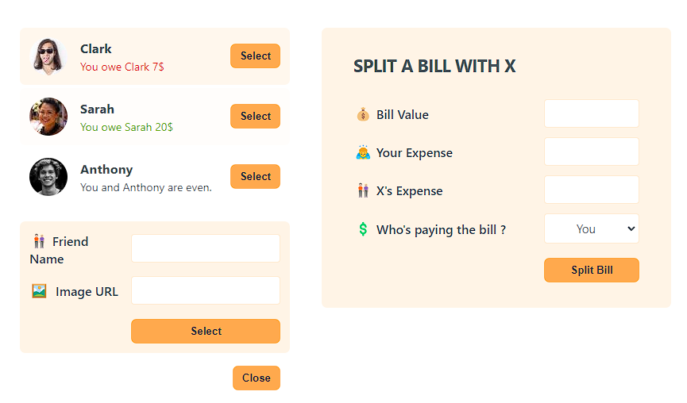

# Eat-n-Split 🍽️💰

Eat-n-Split is a simple and intuitive bill-splitting web application that allows you to keep track of shared expenses with your friends. Easily add friends, input shared expenses, and see who owes what to whom. The application provides a user-friendly interface for splitting bills and managing balances with your friends.

## Features

-  **Add Friends:** Add your friends by providing their name and image URL to visually track your expenses.
-  **Track Expenses:** Split bills and track how much you owe or are owed by each friend.
-  **Bill Splitting:** Input total bill value, your expense, your friend's expense, and determine who paid the bill.
-  **Balances Overview:** Easily see your balance status with each friend—whether you owe them, they owe you, or if you’re even.

## Screenshots



## How It Works

1. **Add Friends:** Add a friend's name and image to start tracking shared expenses.
2. **Split a Bill:** Select a friend from the list and enter the bill details:
   -  **Bill Value:** Total amount of the bill.
   -  **Your Expense:** How much you contributed.
   -  **X's Expense:** How much your friend contributed.
   -  **Who’s Paying the Bill?:** Select who paid the bill (you or your friend).
3. **See Balances:** The app calculates and shows whether you owe money or are owed money by each friend.

## Getting Started

### Prerequisites

Make sure you have the following installed:

-  Node.js (v14 or higher)
-  npm or yarn

### Installation

1. Clone the repository:

   ```bash
   git clone https://github.com/your-username/eat-n-split.git
   ```
